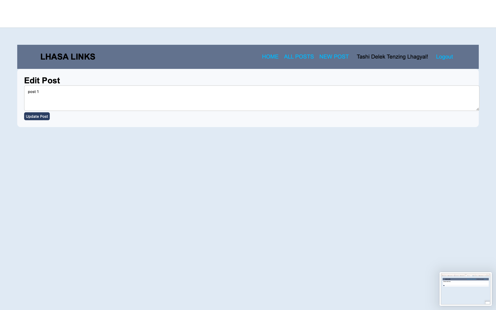

# Lhasa Links
Welcome to Lhasa Links, where Himalayan people from all over the world can connect with one another. Here you can tell your story as a post and then people around the world will be able to engage in a meaningful conversation with you or others by commenting on it or simply liking it. Join us on Lhasa links and let the world hear your story!

## ScreenShots

### Home Page

### All Post Page

### New Post Page

### Edit post Page

## Technologies Used

- EJS
- CSS
- Node.js
- Express
- Google OAuth
- MongoDB
- Heroku

## Getting Started
https://lhasa-links-1876d24c11fe.herokuapp.com

## Stretch Goals

- As a user, I want to recieve notifications when someone comments, likes, or shares my post.
- As a user, I want the option to set posts to private, so that I have control over who can view my content.
- As a user, I would like to track who liked, comment or/and shared my posts.
- As a user, I would like to have my own page with my posts.

